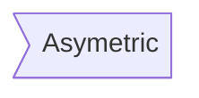

 
> A simple markdown-like script language for generating charts from text via javascript
>
> [官方链接](https://knsv.github.io/mermaid/)


## FlowCharts

### Graph

#### TB

* top bottom

* ```mermaid
  graph TB
  A --> B
  ```

#### BT

* bottom top
* ```mermaid
  graph BT
  A --> B
  ```

#### RL

* right left
* ```mermaid
  graph RL
  A --> B
  ```

#### LR

* left right
* ```mermaid
  graph LR
  A --> B
  ```

#### TD

* TB
* ```mermaid
  graph TD
  A --> B
  ```


## Node

### Simple Node

```
graph LR
id1
```


### Text

```
graph LR
id1[Text]
```


### Round Edge

```
graph LR
id1(Round)
```


### Circle

```
graph LR
id1((Circle))
```


### Asymetric Shape

```
graph LR
id1>Asymetric]
```



### Asymetric Shape

```
graph LR
id1{rhombus}
```


## Links

### Arrow head

```
graph LR
A-->B
```


### Open Link

```
graph LR
A---B
```


### Text On Links

```
graph LR
A---|text|B
```


### A link with arrow head and text

```
graph LR
A-->|text|B

//or A-- text -->B

```


### Dotted link with text

```
graph LR
A-.text.->B
```


### Thick link

```
graph LR
A==>B
```


### Thick link with text

```
graph LR
A==text==>B
```


##SubGraphs
```
subgraph title
    graph definition
end

 %% Subgraph example
 graph TB
         subgraph one
         a1-->a2
         end
         subgraph two
         b1-->b2
         end
         subgraph three
         c1-->c2
         end
         c1-->a2
```


## Interaction
> It is possible to bind a click event to a node, the click can lead to either a javascript callback or to a link which will be opened in a new browser tab.

```
click nodeId callback

 %% example
 graph LR;
    A-->B;
    click A callback "Tooltip for a callback"
    click B "http://www.github.com" "This is a tooltip for a link"
```


## Styling

```
 graph LR
    id1(Start)-->id2(Stop)
    style id1 fill:#f9f,stroke:#333,stroke-width:4px;
    style id2 fill:#ccf,stroke:#f66,stroke-width:2px,stroke-dasharray: 5, 5;
```


## class


```
%% format classDef className fill:#f9f,stroke:#333,stroke-width:4px;

graph LR;
    A-->B[AAABBB];
    B-->D;
    class A cssClass;
```


## Sequence diagrams

> A sequence diagram is an interaction diagram that shows how processes operate with one another and in what order

### Syntax

#### Particapants

> The participants can be defined implicitly as in the first example on this page. The participants or actors are
> rendered in order of appearance in the diagram source text. Sometimes you might want to show the participants in a
> different order than how they appear in the first message. It is possible to specify the actor's order of
> appearance by doing the following:

#### Arrow & Messages & Activations

> Messages can be of two displayed either solid or with a dotted line.

```
[Actor][Arrow][+/-][Actor]:Message text
```

There are six **types of arrows** currently supported:

-> which will render a solid line without arrow

--> which will render a dotted line without arrow

->> which will render a solid line with arrowhead

-->> which will render a dotted line with arrowhead

-x which will render a solid line with a cross at the end (async)

--x which will render a dotted line with a cross at the end (async)

```
%% Example of sequence diagram
sequenceDiagram
    participant Hg
    participant Dendi
    Hg -> +Dendi: ->
    Hg --> Dendi: -->
    Hg ->> Dendi: ->>
    Hg --> Dendi: -->
    Hg -->> Dendi: -->>
    Hg -x Dendi: -x
    Hg --x Dendi: --x
```

```mermaid
%% Example of sequence diagram
sequenceDiagram
    participant Hg
    participant Dendi
    Hg -> +Dendi: ->
    Hg --> Dendi: -->
    Hg ->> Dendi: ->>
    Hg --> Dendi: -->
    Hg -->> -Dendi: -->>
    Hg -x Dendi: -x
    Hg --x Dendi: --x
```

#### Notes

```
Note [right of | left of|over] of [actor] : [Text]:

%% Example of sequence diagram
sequenceDiagram
    participant Hg
    participant Dendi
    Hg -> Dendi: ->
    Note right of Dendi : Note right of Dendi
    Note over Hg , Dendi : Note over Hg , Dendi
```


#### Loops
```
loop Loop text
... statements ...
end

%% Example of sequence diagram
sequenceDiagram
    participant Hg
    participant Dendi
    Hg -> Dendi: ->
    loop Reply every minute
        John->Alice: ->
    end
```


#### Alt

```
alt [Describing text]
... statements ...
else
... statements ...
end

opt Describing text
... statements ...
end

%% Example
sequenceDiagram
    participant Hg
    participant Dendi
    Hg -> Dendi: ->
    alt condition A
		Dendi->Hg: A
	else
		Dendi->Hg: not A
    end
    
    opt Extra
        Dendi->Hg: Extra
    end
```

```mermaid
sequenceDiagram
    participant Hg
    participant Dendi
    Hg -> Dendi: ->
    alt condition A
		Dendi->Hg: A
	else
		Dendi->Hg: not A
    end
    
    opt Extra
        Dendi->Hg: Extra
    end
```

##Gant diagrams
> A Gantt chart is a type of bar chart, first developed by Karol Adamiecki in 1896, and independently by Henry Gantt in the 1910s, that illustrates a project schedule. Gantt charts illustrate the start and finish dates of the terminal elements and summary elements of a project.

```
gantt
	[format]
	title [title]
	
		section [Section Name]
		[Task Name] 	:[label],[time point],[duration]
		[Task Name] 	:[label],[time point],[duration]

%% Example of sequence diagram
gantt
    title A Gantt Diagram
    dateFormat  YYYY-MM-DD

    section Section
    A task           :a1, 2014-01-01, 30d
    Another task     :after a1  , 20d
    section Another
    Task in sec      :2014-01-12  , 12d
    anther task      : 24d
```

```mermaid
gantt
    title A Gantt Diagram
    dateFormat  YYYY-MM-DD

    section Section
    A task           :a1, 2014-01-01, 30d
    Another task     :after a1  , 20d
    section Another
    Task in sec      :2014-01-12  , 12d
    anther task      : 24d
```